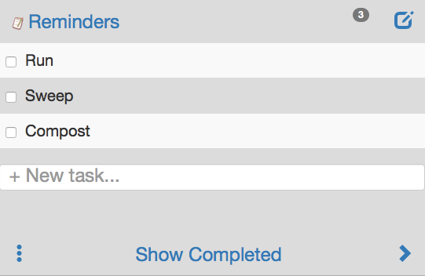

Reminders
=========

Credit to Angular, Bootstrap, Express, Glyphicons, Node, MongoDB, and Passport.
Hosted by Vercel, Google APIs, and [MongoDB Atlas](https://cloud.mongodb.com).

This SaaS [Reminders App](https://reminders-ashen.vercel.app) manages a user defined set of task lists. I use it instead of the weekly paper task lists that I used to keep. This will likely be more interesting as an example of a fully working cloud hosted three tier application with make scripts and deployment instructions written entirely in Java Script and HTML.



## Demo
Try out [Reminders App](https://reminders-ashen.vercel.app).

## Docs
[Reminders App Documentation](https://github.com/yodertv/Reminders/tree/master/doc) has simple notes for bugs, build, test and run.

## Features
- Manages - lists of Reminders (aka tasks, or todos).
- Persists - reminder data on mongodb using angular's ngResource, $http service and mongojs.
- Show Completed - shows all reminders including items where done:true.
- Hide Completed - hides all reminders where done:true. This also moves the completed items below the last undone item.
- Add - new task to the list with done:false; Saves the new task to the DB.
- Checkbox - when checked: done:true; Item's text is displayed as strike-through; Saves the updated item to the DB.
- Edit icon - shows and hides the complete checkbox or delete icon.
- Delete icon - trash can deletes a task from a list or a list from the lists.  
- Welcome - This page gives information about the application and the current user if authenticated, otherwise it provides information about the application and a login dialog screen.
- Assigns - storage for new users from a pool of pre-allocated DBs.
- Used on - IE, nook browser, iTouch, Safari, iPhone, Chrome on Mac.
- Responsive - to three device sizes. Uses pills for navigation and a small menu.
- Forward button - takes you to the next task list.
- HTM5 and Angular Routing - support browser back and deep linking to archives and any page. 
- Rest apiPath is configurable.
- Login to /auth/local, with failure notification, for testing.
- Logs user name and other req info using cookies and the bunyan logger at multiple levels.
- Displays a ```...loading...``` message while fetching data. 

## Deployments
- All deployment knowledge is in make.js and build_props_files.
- Property files to produce builds that can be hosted on localhost, localnet, 127.0.0.1, and Vercel.
- Mongodb can be hosted on localhost, localnet, and mLab.

## Dependancies
- Client depends on glyphicons, bootstrap, angular, and jquery.
- Server depends on express, passport, http, and mongojs.
- DB depends on MongoLab for production and local mongodb for dev.

## Backlog
- Use the "Seed Database" concept from mogodb-starter to automate DB provisioning. Overcome by the concept of simply creating an empty database for new users.
- AngularJS is deprecated. https://blog.angular.dev/finding-a-path-forward-with-angularjs-7e186fdd4429.
- 17:49:26.796  warning express > connect@2.7.2: connect 2.x series is deprecated.
- Search feature to find tasks.
- Scroll to insert point when it is obscured.
- Display counts of uncompleted tasks from each list on Lists page.
- Capture creation datetime and store with task.
- Support scheduled tasks.
- Protect API from malformed requests and nonsense.
- Add unit testing.
- Add API documentation and testing.
- Consider making the build manifest in JSON notation rather than string.
- Minimize trips to server. Keep data cached between pages.
- Test preserving some global data so that it doesn't all get blown away and refreshed with ```$scope```.
- Support addvertisments.
- Work off-line.
- Add a print feature.

## History

### Refresh docs and publish.
- Updated welcome.html for Vercel deployment.
- Deprecated db creation. No longer needed. Mongo Atlas allows the app to create a new DB via the api.
- Handle initialization errors when no USER_BD defined.

### Remove last reference to stateful .ul.
- Working fully on vercel using local auth.

### Use vercel-test pattern to make GET_DOCS acsychronous.
- Remove leeking credential trace statement.
- Set dbUrl for vercel prod deployment.

### Use vercel-test pattern to make GET_DOCS acsychronous.
- Reported and fixed (Bug#58).
- Made GET_DOCS block for find() results.
- Made GET_COLLECTIONS block for getCollections().
- Vercel dev working for rough smoke testing.

### Use vercel-test pattern to make findByEmail() acsychronous.
- Working on branch master.
- (90199f7) Deserialize user doesn't break.
- Made /auth/local via passport.use(new LocalStrategy()) async so it will work with the async findByEmail() under vercel dev.

### Use vercel-test pattern to handle initialization errors in todoServer.js api - 2024.12.01.
- Return a handler with an error message if any initialization conditions fail.
- Opportunistically move features from API to main.js that are for local operations and testing.

### Use vercel-test pattern to remove static api from Todo - 2024.11.29.

### Returning to build and deploy issues 2024.11.29
- Now vercel dev is running my build command!?
- Restructured the build with DIST_PATH="".

### Run vercel in build directory 2024.11.26
- Fixed build and route declarations.
- Updated run-book.
- Learned the vercel dev reads the .env file I deploy in build. Only needed for main.js.

### Clean up build processs 2024.11.25
- Review and refactor all build and environment variables.
- Move MONGO_USER_DB_NAME from build_props to env var.
- Make supports dotenv by copying ```./.env.<build environment> to ./build/.env``` the default source for the dotenv package.

### Factor out static express server 2024.11.22
- Routing questions. How to run with node using the same code and build base.
- Working idea is to route static stuff specifically in vercel.json. Under node express.static runs in the main module.

### Working tag: 2024.11.16
- Working on vercel dev local. Code is building through vercel locally and online.
- Working to make a package that exports the express app so that it can be called by vercel's serverless function hook.
- Good to know: build and functions declarations in vercel.json are not compatible. A deployment must use one or the other. See https://vercel.link/functions-and-builds.

### Working tag: working-2024.10.23
- Developed a pattern with vercel-test. Applying it in Todos now.
- Attempting vercel deployment via github.
- Now attempting vercel dev locally.

### Working tag: working-2024.10.13
- Mongo and Atlas API seem to be able to create dbs on the fly. Will use this to refactor user-list.js which currently expects a pre-allocated db because of the past constraints.
- Started tagging working versions with the date to relate them back to the readme.

### Working Version (10.6.24) (tag: working-2024-10-06)
- Addressed new URL specs for Atlas vs. localhost.
- Refactoring mongo db opening code into a single function.
- Working out using Atlas hosted user datastore.
- Installed nvm, Node, Mongo community v5.0.28, build and run locally.
- Learned the AngularJS is deprecated.

### Working Version (09.17.20)
- Upgraded mongod and shell to 4.4.0. Tested on localhost.

### Version 0.6.3 (02.15.2020)
- Upgraded now cli, nodejs locally, force version 1 of zeit, removed nodejs engine version to use default.

### Version 0.6.2 (12.27.2017)
- Fixed (Bug#51) -- Object GET function defeated by the wild card GET.
- Fixed (Bug#46) -- Object Actions should open DB rather than error out.
- Fixed (Bug#48) -- Zeit logs no Source IP address.

### Version 0.6.1 (12.23.2017)
- Documented and fixed (Bug#50) -- User list is printed twice.
- Updated Readme

### Version 0.6.0 (12.02.2017)
- Documented and fixed (Bug#49), handling 'no available DBs' condition more gracelfully.
- Refactor logging to use node-bunyan.
- Added view count to cookie and print user list nicely.
- Use only one auth strategy based on environment.
- Use node 8.3.

### Version 0.5.6 (04.14.2017)
- Changes for migration to zeit now deployment and updated docs and README.

### Version 0.5.5 (11.25.2016)
- More responsive with better looking boarders.
- Secured with https.
- Prepared for publishing as yodertv/Reminders with improved docs and Readme.

### Version 0.5.4 (11.25.2016)
- Delt with layout on bigger screens and handling iPhone 5 size.
- Turned on https:// at modular.net and did associated google api and build_prop changes.

### Version 0.5.3 (11.13.2016)
- Updated to the latest stable version of angular 1.5.8.
- Make copyright footer small enough for iphone 5.
- Fixed related (Bug#45) for smaller screens. 

### Version 0.5.2 (10.29.2016)
- Need to calculate number of rows visible and scroll to add index if possible. Use varible.
- Check on angular version. Angular home page demos use 1.5.8.
- Footer size changes between pages and based on content size. Use function to simplify code.
- Move text input filed to end of list until end of list is obscured. Then dock in the footer as it does now. Should fix Bug(#42).
- Refactored file names to reflect the new use case of list instead of history. Eliminated one partial html file. 

### Version 0.5.1 (10.15.2016)
- Using apple reminders as a model. Have merged TodoCtrl with ListCtrl.
- Working version of showing and hiding todos in todo controler.
- Renamed default collection "todo" to "Reminders".
- Ability to reuse common tasks. See repeating task below.
- Give the user a way to reuse tasks. Simply uncheck the completed state to bring back an existing task.
- Fixed (bug#41) where old style list names didn't show properly.
- Upgrade to mongojs 2.1
- Refactored by changing archives to lists, and show completed, new list creation instead of archive button
- Split welcome page so all info that doesn't require auth is shown.
- Chose font size to get the nicest size on the iphone plus.
- Learned that I got a larger app feel by increasing the font size.

### Version 0.4.3 (8.23.2016)
- Properly assign new DBs in GoogleStrategy handler
- Updated run-book with more details.
- Replaced memoryStore with cookie-session. Sessions maxAge =  72 hrs.

### Version 0.4.2 (1.13.2016)
- Added '...loading...' message while todo lists, and history load.
- Remove day of week from last year's archives.
- Documented (Bug#35) Todo server doesn't handle timeout.

### Version 0.4.1 (1.1.2016)
- Add google auth for production.
- Externalize GOOGLE api credentials.
- Tested Auth switching between environments.
- Added build for 127.0.0.1 to support local testing with google auth.
- Sends server environment to the client with the /acount method.
- Cleaned-up cosole log messages.
- Testing new DBs on modulus.

### Version 0.4.0 (12.26.2015)
- Seperated bugs and resolution info into bugs.md
- Fixed intercept function for auth failure in XHR calls.
- Added user-list.js module for managing use registration. Retires internal list.
- Deployed userList collection to mongoLab and externalized userDbName.
- Display mongodb host as wells as registered DB on welcome screen.
- Require DB authentication in production.
- Tested registering a db that doesn't exist. Works only with no auth.
- Fixed (Bug#33) by upgrading to bootstrap to 3.3.6.
- Deployed to modulus.

### Version 0.3.4 (12.22.15)
- Testing on localnet with multiple devices.
- Added logging user name.
- Fixed (Bug#25).
- Updated README.

### Version 0.3.3 (12.19.15)
- Documented and fixed (Bug#30) Don't send password to client.
- Added failure message on welcome page when login fails.
- Documented and fixed (Bug#29) Unexpected concatenation of routes.
- Documented and fixed (Bug#28) dbName undefined.
- Add user list and lookup database by user.
- Add welcome and login screens by merging html-todos with Todos.
- Fixed global replacement in make.js sed commands for BAKING in variables.

### Version 0.3.2 (12.14.15)
- Moved db knowledge to server and updated apiPath.
- Documented (Bug#27) -- Server silently sends the client crap when not able to connect to db.
- Added session monitor interval function.

### Version 0.3.1 (12.13.15)
- Merge finally working for local auth. But can't add tasks. Found body parser was consuming form data before the URL handler. Fixed.
- Merge multi-user and multi-auth from html-todos and Auth projects.
- Noted (Bug#25) that button/title doesn't show year when it is different from current year.
- Documented and fixed (Bug#26) Opening via get collections failed because of no dbUrl variable.

### Version 0.3.0 (12.2.2015)
- Fixing build and tagging v0.3.0. Major release because of all the dependancies that were upgrades.
- Server running 5.1.1.
- Rolled the devEnvironment back to node v4.2.2 and npm 2.14.7.
- Build the node_modules dependancies. Use npm install.
- Upgraded node and npm to the latest 5.1.0 and 3.3.12 respectively.
- Documented and corrected (Bug#22) Auth failures with mongolab using mongojs.
- Documented and corrected(Bug#20) DB_INSERT_ERR: MongoError: Invalid Operation, No operations in bulk.
- Documented and corrected (Bug#19) Event emitter leak.
- Documented and corrected (Bug#18) Duplicate objectID error.
- Deployed to nodjitsu
- Tested at merchants wifi. Worked from iPhone on AK's local area net.
- Made an attempt to fix (Bug#18). Hard to reproduce. Put the insert in the callback of the drop(), but noticed that dropping an empty collection resulted in an error so ignoring drop errors.
- Then completed the refatoring.
- Refactored to use express with minimal changes.
- Added "logDate" build prop to make bake step.
- Formated the logger output.
- Tested w/ Mongodb v3.0.1. Worked with upgraded mongjs.
- Added db to list for old version of mongo installed on katrinas-macbook-air.

### 2.5
- Tested quite a bit on Linda's local net. Did not encounter (Bug#17) did git dublicate ID (Bug#18) once.
- Fixed (Bug#9) New route version doesn't route reloading. History and list pages fail. Adds list to (Bug#7)
- Fixed (Bug#7) With new angular and locationProvider fails to reload history page. Solved by redirecting to /#history and /#list.

### 2.4
- Tested localnet build and run on kitchen-mac. Tested iPad, iTouch, IE 9 on windows, Chrome on windows, Chrome on Nook.
- Enhanced server to start based on nodeURL for port. No longer takes port argument.
- Server creates hundreds of connections. Fixed by making a global array. Working.
- Unable to duplicate the two DB bugs on local host in the car to WVA (2.13.15).
- Changed local host build from 127.0.0.1 to localhost.

### 2.3
- Fixed (Bug#16) Update of existing todos in history list.
- Limit file server to only static files. Static server does NOT serve up the server files or the package.json file.
- Enhanced make.js to support the new file structure.

### 2.2
- Merged with original 2.2 which added full editing mode in the history.

### 2.1.3
- Use shelljs.sed to "bake" variables into the scripts. Keeping @ANT@ format.
- Newest bootstrap version 3.3.1. Didn't work. Went back.
- Further testing found two bugs (Bug#8) and (Bug#9)
- Work off-line better with local mongodb.
- Got getCollectionNames() and collection.drop() working on local host. Curious about the number of collections opening. That must be the mongojs library. I added close() to the method I tested.
- Interesting behavoir with the new route, reloading doesn't get "routed".
- Objective to leave ngResource unchanged (i.e. reproduce the REST API)
- Fixed (Bug#8) Drop collection fails to return (HTTP Pending).
- Fixed (Bug#13) Inserting an array to a collection doesn't have the expected behavior of replacing the collection.
- Fixed (Bug#11) Update to task fails.
- Fixed (Bug#15) The inserted data from the client doesn't preserve the mongo ObjectID.
- FIxed (Bug#10) two ```_id``` forms in DB 

### 2.1.2
- Use $locationProvider.html5Mode(true) to eliminate # in my URLs.
- Had this error https://docs.angularjs.org/error/$location/nobase and fixed it.
- Refactored module comand for better readability following tutorial examples.
- Removed extraneous ":" from URLs href'ed by history.html and todo.html.
- Deployed as yodertst.nodejitsu.com with active snapshot: "0.2.1-7 Sunday, January 11, 2015 15:17:32"

### 2.1.1
- Explored using node as build script. Using commander and shelljs.
- Created clean, prep, build, install commands framework. See DevNotes for more info.
- Use package.json file for my two configuration items, src_dir, build_dir and lib_dir
- Changed bake to prep and added node_module dependancy check.
- Upgraded angular to solve :port issue with ngResource. Version 1.3.8
- Still one bug (Big#??). Today page is blank when routed to from History. -- Fixed by adding '/' after #.

### 2.1
- Use node-static to serve up my static files.
- Load css files before scripts fixed BB bug. Found with Chrome audit feature.
- (Bug#4-Fixed) Nodejitsu hosted version fails the CSS on my BB bold. I believe I'm using the same style sheets as the working version. No way to debug it yet.
- Move DB key back to server and off the client.
- Client sets DB. Query string for archive delete method to pass in the DB name.
- (Bug#5-Fixed) Still failing on IE 9. IE dev tools don't help with this security error, but google did. Found the trick was to start the app w/ the /#/ version of the URL.

### 2.0
- Enhanced todoServer.js to proxy mongo's REST api and allow non-CORS compliant browsers to access the data. Still need a place to host todoServer.js on Node. ie 9 can view the data, but it still broken from a style sheet prespective.
- Fixed (Bug#2) Doesn't work on IE or Nook, likely due to lack of CORS support. 
- Enhanced ro remove archives from the archive list. I delete collections with mongojs.
- Discovered the Puffin browser for nook. Works with Todos 1.4. Now only IE fails. I don't think I care.
- Deployed to nodjitsu to some success. Proxy bug sent me a erant re-direct.
- Mongolab support fixed thier proxy bug.
- Adding https before deploying nodejitsu. Here's how:
	- openssl genrsa -out privatekey.pem 1024 
	- openssl req -new -key privatekey.pem -out certrequest.csr 
	- openssl x509 -req -in certrequest.csr -signkey privatekey.pem -out certificate.pem
- Nodejitsu handles the SSL in their proxy. No need to deploy the above. So it works locally, not in the cloud.
- Deployed using jitsu deploy. jitsu list, and jitsu logs.

### 1.5
- Merge Node v0.4 MongoApp drop collection code into StaticServer and rename as todoServer
- Change mongolab.js to add a dropArchive function.
- Fixed (Bug#3) Archive forward button isn't pointing to next older archive.
- This release can't go to production because I need a place to host my node drop function.
- StaticServer is deco'd

### 1.4
- Deleting tasks in archives now works
- Hosted in node.js StaticServer.js @ http://desk-pc
- Refactored getArchiveList into it's own function and moved into service, mongolab.js.
- buildArchiveList used three times so it's now a function shared by three controllers.
- Refactor all DB access into the mongolab module.
- Fixed (Bug#1) Archive steps on previous archive data. 
- Tweaked html views with some &nbsp; to make the view a little nicer.
